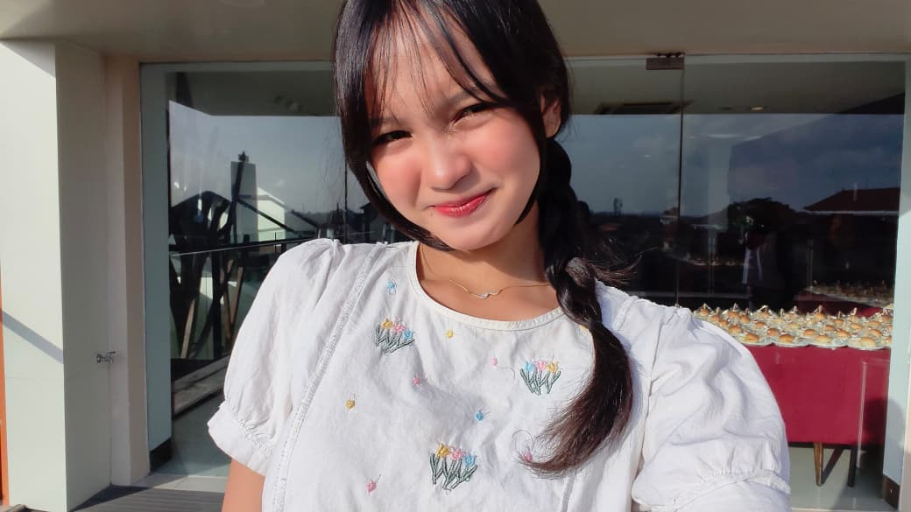
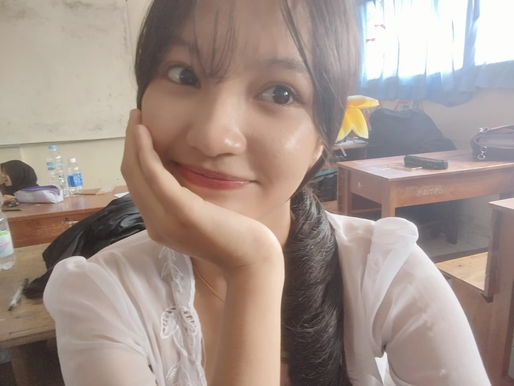
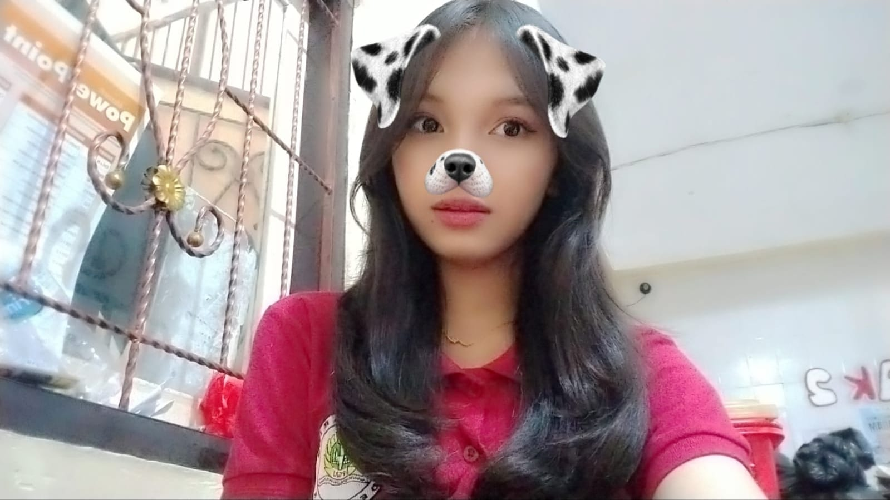

<!DOCTYPE html>
<html lang="id">
<head>
    <meta charset="UTF-8">
    <meta name="viewport" content="width=device-width, initial-scale=1.0">
    <meta name="description" content="Selamat Ulang Tahun Untuk Semesta Kecilku">
    <title>Selamat Ulang Tahun Sayanggggg ❤️</title>
    <link rel="stylesheet" href="randomm.css">
</head>
<body>

    <header class="main-header">
        

            

                <a href="#">Satu Renjana</a>
            

            <nav class="navbar">
                <ul class="nav-list">
                    <li class="nav-item"><a href="#hero" class="nav-link active">Awal</a></li>
                    <li class="nav-item"><a href="#puisi" class="nav-link">Bait Kata</a></li>
                    <li class="nav-item"><a href="#kenangan" class="nav-link">Mozaik Usia</a></li>
                    <li class="nav-item"><a href="#harapan" class="nav-link">Doa & Asa</a></li>
                    <li class="nav-item"><a href="#surat" class="nav-link">Surat Rahasia</a></li>
                </ul>
            </nav>
            

                <button class="btn btn-music" id="musicToggle">🎵 Putar Melodi</button>
            

        

    </header>

    <section id="hero" class="hero-section">
        

            

                Hari Istimewa Sang Rembulan
                <h1 class="hero-title">Selamat Ulang Tahun Sayangg, Untukmu yang Menjelma Rumah</h1>
                

                    "Di antara miliaran detik yang berputar di semesta, detik saat kamu dilahirkan adalah alasan mengapa duniaku kini penuh dengan warna."
                

                

                    <a href="#puisi" class="btn btn-primary btn-lg">Ayo Pencett babee</a>
                    <a href="#surat" class="btn btn-secondary btn-lg">Buka Ini Sayangg</a>
                

            

            

                
            

        

    </section>

    <main class="main-content">

        <section id="puisi" class="poetry-section">
            

                

                    <h2>Bait Kata dalam Barisan Usia</h2>
                    
Sebuah persembahan kecil dari jiwa yang selalu mengagumimu.

                

                

                    <article class="poetry-card">
                        
🕯️

                        <h3>Lilin yang Tak Pernah Padam</h3>
                        

                            Bukan tentang berapa banyak lilin yang kau tiup hari ini, 
                            melainkan tentang hangatnya senyummu yang selalu meredakan gelisahku. 
                            Teruslah menyala, tanpa perlu takut redup dimakan waktu.
                        

                    </article>

                    <article class="poetry-card">
                        
🌙

                        <h3>Penjaga Sunyi</h3>
                        

                            Di saat malam merayap pelan dan duniaku terasa bising, 
                            hadirmu adalah keheningan yang paling menenangkan. 
                            Terima kasih telah lahir dan tumbuh menjadi sosok yang begitu luar biasa.
                        

                    </article>

                    <article class="poetry-card">
                        
🌸

                        <h3>Pekarangan Musim Bunga</h3>
                        

                            Setiap tahun yang bertambah pada usiamu, 
                            adalah kelopak bunga baru yang bermekaran di dalam dadaku. 
                            Mekarlah dengan indah, sebab seluruh dunia berhak melihat pesonamu.
                        

                    </article>
                

            

        </section>

        <section id="kenangan" class="gallery-section">
            

                

                    <h2>Wajah Yang Akan Abadi Di Hatiku</h2>
                    
Beberapa Foto Bidadariku

                

                

                    

                        
                        

                            <h4>Awal Cerita Kita</h4>
                            
"Saat kita belum sama-sama mengenal, kau sombong padaku."

                        

                    

                    

                        
                        

                            <h4>Jejak Langkah</h4>
                            
"Hingga akhirnya tawamu berhasil membuatku menghentikan waktu. "

                        

                    

                    

                        
                        

                            <h4>Binar di Matamu</h4>
                            
"Kamu sangat indah."

                        

                    

                    

                        
                        

                            <h4>Sore yang Hangat</h4>
                            
"Hanya bincang ringan diiringi rasa bahagia yang bergejolak. "

                        

                    

                

            

        </section>

        <section id="harapan" class="wishes-section">
            

                

                    <h2>Langitkan Doa di Hari Bahagiamu</h2>
                    
Harapan-harapan tulus yang selalu kuaminkan setiap kali menyebut namamu.

                

                

                    

                        
01

                        <h3>Bahagia yang Melimpah</h3>
                        
Semoga setiap rasa lelahmu selalu dibayar tuntas dengan tawa yang renyah dan ketenangan hati yang tak bertepi.

                    

                    

                        
02

                        <h3>Langkah yang Diberkahi</h3>
                        
Semoga semua impian besar yang sering kau ceritakan padaku sebelum tidur, satu per satu menjadi kenyataan.

                    

                    

                        
03

                        <h3>Kesehatan & Keselamatan</h3>
                        
Semoga semesta senantiasa mendekapmu dalam lindungan-Nya, menjaga fisik dan jiwamu dari segala hal yang melukai.

                    

                    

                        
04

                        <h3>Kita yang Tak Kesudahan</h3>
                        
Dan semoga, di setiap ulang tahunmu yang berikutnya, tetap ada tanganku yang bisa kau genggam erat.

                    

                

            

        </section>

        <section id="surat" class="letter-section">
            

                

                    

                        <h2>Surat Kecil di Ujung Hari</h2>
                        Ditulis khusus untuk hari bertambahnya usiamu
                    

                    

                        
Untukmu yang hatinya seluas samudra,

                        

                            Selamat ulang tahun. Terima kasih telah bertahan sejauh ini, terima kasih telah menjadi manusia paling hangat yang pernah kukenal. Dunia mungkin sering kali bersikap keras, namun caramu menyikapinya dengan kelembutan selalu membuatku kagum.
                        

                        

                            Di usia yang baru ini, jangan pernah ragu untuk mengejar apa yang kau cintai. Ingatlah bahwa di mana pun kamu berada, akan selalu ada aku yang bangga atas setiap proses kecil dalam hidupmu. Kamu tidak pernah sendiri.
                        

                        

                            Dengan segenap rasa yang terus tumbuh, 
                            <strong>Seseorang yang mencintaimu selalu.</strong>
                        

                    

                

            

        </section>

    </main>

    <footer class="main-footer">
        

            

                
"Selama bumi masih berputar, selama itu pula namamu ada dalam setiap doa."

                
✨ ❤️ ✨

                
&copy; Dibuat dengan penuh cinta untuk merayakan hari kelahiranmu.

            

        

    </footer>

    

</body>
</html>

/* ==========================================================================
   1. IMPORT FONT & GLOBAL VARIABLES
   ========================================================================== */
@import url('https://fonts.googleapis.com/css2?family=Dancing+Script:wght@600;700&family=Poppins:wght@300;400;600&display=swap');

:root {
    --pink-primary: #ff4d8d;
    --pink-secondary: #ff75a0;
    --pink-light: #fff0f5;
    --pink-soft: #fec5bb;
    --pink-dark: #d62ad0;
    --gradient-bg: linear-gradient(135deg, #ff9a9e 0%, #fecfef 50%, #feada6 100%);
    --gradient-card: linear-gradient(145deg, rgba(255, 255, 255, 0.9), rgba(255, 228, 230, 0.7));
    --shadow-soft: 0 10px 30px rgba(255, 77, 141, 0.2);
    --shadow-glow: 0 0 20px rgba(255, 117, 160, 0.6);
}

/* ==========================================================================
   2. RESET & BASE STYLES
   ========================================================================== */
* {
    margin: 0;
    padding: 0;
    box-sizing: border-box;
    scroll-behavior: smooth;
}

body {
    font-family: 'Poppins', sans-serif;
    background: var(--gradient-bg);
    color: #4a4a4a;
    line-height: 1.7;
    overflow-x: hidden;
    min-height: 100vh;
}

.container {
    max-width: 1100px;
    margin: 0 auto;
    padding: 0 20px;
}

/* ==========================================================================
   3. ANIMASI GLOBAL (KEYFRAMES)
   ========================================================================== */
@keyframes float {
    0%, 100% { transform: translateY(0px) rotate(0deg); }
    50% { transform: translateY(-12px) rotate(1deg); }
}

@keyframes pulseGlow {
    0%, 100% { box-shadow: 0 0 15px rgba(255, 77, 141, 0.4); transform: scale(1); }
    50% { box-shadow: 0 0 30px rgba(255, 77, 141, 0.8); transform: scale(1.03); }
}

@keyframes fadeInUp {
    from {
        opacity: 0;
        transform: translateY(30px);
    }
    to {
        opacity: 1;
        transform: translateY(0);
    }
}

@keyframes heartBeat {
    0% { transform: scale(1); }
    14% { transform: scale(1.3); }
    28% { transform: scale(1); }
    42% { transform: scale(1.3); }
    70% { transform: scale(1); }
}

/* ==========================================================================
   4. HEADER & NAVBAR
   ========================================================================== */
.main-header {
    position: fixed;
    top: 0;
    left: 0;
    width: 100%;
    background: rgba(255, 255, 255, 0.85);
    backdrop-filter: blur(10px);
    z-index: 1000;
    box-shadow: 0 4px 20px rgba(255, 182, 193, 0.3);
    padding: 15px 0;
    transition: all 0.3s ease;
}

.main-header .container {
    display: flex;
    justify-content: space-between;
    align-items: center;
}

.logo a {
    font-family: 'Dancing Script', cursive;
    font-size: 2rem;
    font-weight: 700;
    color: var(--pink-primary);
    text-decoration: none;
    text-shadow: 1px 1px 2px rgba(0,0,0,0.1);
}

.nav-list {
    display: flex;
    list-style: none;
    gap: 20px;
}

.nav-link {
    text-decoration: none;
    color: #666;
    font-weight: 600;
    font-size: 0.95rem;
    transition: color 0.3s ease;
    position: relative;
}

.nav-link::after {
    content: '🌸';
    position: absolute;
    bottom: -15px;
    left: 50%;
    transform: translateX(-50%) scale(0);
    transition: transform 0.3s ease;
    font-size: 0.8rem;
}

.nav-link:hover, .nav-link.active {
    color: var(--pink-primary);
}

.nav-link:hover::after, .nav-link.active::after {
    transform: translateX(-50%) scale(1);
}

/* ==========================================================================
   5. BUTTONS (TOMBOL INTERAKTIF)
   ========================================================================== */
.btn {
    display: inline-block;
    padding: 12px 28px;
    border-radius: 50px;
    text-decoration: none;
    font-weight: 600;
    border: none;
    cursor: pointer;
    transition: all 0.4s cubic-bezier(0.175, 0.885, 0.32, 1.275);
}

.btn-primary {
    background: linear-gradient(45deg, var(--pink-primary), var(--pink-secondary));
    color: white;
    box-shadow: var(--shadow-soft);
}

.btn-primary:hover {
    transform: translateY(-4px) scale(1.05);
    box-shadow: var(--shadow-glow);
}

.btn-secondary {
    background: white;
    color: var(--pink-primary);
    border: 2px solid var(--pink-secondary);
}

.btn-secondary:hover {
    background: var(--pink-light);
    transform: translateY(-4px);
}

.btn-music {
    background: #ffe6ee;
    color: var(--pink-primary);
    font-size: 0.9rem;
    animation: pulseGlow 3s infinite;
}

/* ==========================================================================
   6. HERO SECTION
   ========================================================================== */
.hero-section {
    padding: 160px 0 90px;
    min-height: 80vh;
    display: flex;
    align-items: center;
}

.hero-section .container {
    display: grid;
    grid-template-columns: 1.2fr 0.8fr;
    gap: 40px;
    align-items: center;
}

.birthday-badge {
    background: #ffffff;
    color: var(--pink-primary);
    padding: 6px 18px;
    border-radius: 20px;
    font-size: 0.85rem;
    font-weight: 600;
    box-shadow: var(--shadow-soft);
    display: inline-block;
    margin-bottom: 15px;
    animation: fadeInUp 1s ease;
}

.hero-title {
    font-family: 'Dancing Script', cursive;
    font-size: 3.2rem;
    color: #800f2f;
    line-height: 1.2;
    margin-bottom: 20px;
    animation: fadeInUp 1.2s ease;
}

.hero-subtitle {
    font-style: italic;
    color: #555;
    font-size: 1.1rem;
    margin-bottom: 30px;
    animation: fadeInUp 1.4s ease;
}

.hero-buttons {
    display: flex;
    gap: 15px;
    animation: fadeInUp 1.6s ease;
}

.hero-image-frame {
    position: relative;
    text-align: center;
    animation: float 5s ease-in-out infinite;
}

.profile-img {
    width: 100%;
    max-width: 380px;
    border-radius: 30px;
    border: 8px solid white;
    box-shadow: var(--shadow-soft);
    transition: transform 0.5s ease;
}

.profile-img:hover {
    transform: scale(1.03) rotate(-2deg);
}

/* ==========================================================================
   7. SECTION HEADINGS
   ========================================================================== */
.section-title {
    text-align: center;
    margin-bottom: 50px;
}

.section-title h2 {
    font-family: 'Dancing Script', cursive;
    font-size: 2.8rem;
    color: var(--pink-primary);
}

.section-title p {
    color: #777;
    font-size: 0.95rem;
}

/* ==========================================================================
   8. POETRY / PUISI SECTION
   ========================================================================== */
.poetry-section {
    padding: 80px 0;
}

.poetry-grid {
    display: grid;
    grid-template-columns: repeat(auto-fit, minmax(280px, 1fr));
    gap: 30px;
}

.poetry-card {
    background: var(--gradient-card);
    padding: 35px 25px;
    border-radius: 24px;
    border: 1px solid rgba(255, 255, 255, 0.8);
    box-shadow: var(--shadow-soft);
    text-align: center;
    transition: all 0.4s ease;
    animation: fadeInUp 1s ease;
}

.poetry-card:hover {
    transform: translateY(-10px);
    box-shadow: var(--shadow-glow);
    background: white;
}

.card-icon {
    font-size: 2.5rem;
    margin-bottom: 15px;
    display: inline-block;
    animation: heartBeat 2.5s infinite;
}

.poetry-card h3 {
    color: var(--pink-primary);
    margin-bottom: 15px;
}

.poem-text {
    font-size: 0.95rem;
    color: #666;
    line-height: 1.8;
}

/* ==========================================================================
   9. GALLERY SECTION
   ========================================================================== */
.gallery-section {
    padding: 80px 0;
}

.gallery-grid {
    display: grid;
    grid-template-columns: repeat(auto-fit, minmax(230px, 1fr));
    gap: 20px;
}

.gallery-item {
    position: relative;
    border-radius: 20px;
    overflow: hidden;
    box-shadow: var(--shadow-soft);
    aspect-ratio: 4/3;
}

.gallery-item img {
    width: 100%;
    height: 100%;
    object-fit: cover;
    transition: transform 0.6s ease;
}

.gallery-overlay {
    position: absolute;
    inset: 0;
    background: linear-gradient(to top, rgba(255, 77, 141, 0.85), transparent);
    display: flex;
    flex-direction: column;
    justify-content: flex-end;
    padding: 20px;
    color: white;
    opacity: 0;
    transition: opacity 0.4s ease;
}

.gallery-item:hover img {
    transform: scale(1.15);
}

.gallery-item:hover .gallery-overlay {
    opacity: 1;
}

/* ==========================================================================
   10. WISHES / HARAPAN SECTION
   ========================================================================== */
.wishes-section {
    padding: 80px 0;
}

.wishes-grid {
    display: grid;
    grid-template-columns: repeat(auto-fit, minmax(220px, 1fr));
    gap: 25px;
}

.wish-card {
    background: rgba(255, 255, 255, 0.7);
    backdrop-filter: blur(5px);
    padding: 30px 20px;
    border-radius: 20px;
    position: relative;
    border-left: 5px solid var(--pink-primary);
    box-shadow: var(--shadow-soft);
    transition: transform 0.3s ease;
}

.wish-card:hover {
    transform: translateX(8px);
    background: white;
}

.wish-number {
    font-size: 2rem;
    font-weight: 700;
    color: var(--pink-soft);
    position: absolute;
    top: 15px;
    right: 20px;
}

.wish-card h3 {
    color: var(--pink-primary);
    font-size: 1.1rem;
    margin-bottom: 10px;
}

/* ==========================================================================
   11. LETTER / SURAT RAHASIA
   ========================================================================== */
.letter-section {
    padding: 90px 0;
}

.letter-wrapper {
    background: #ffffff;
    padding: 50px;
    border-radius: 30px;
    box-shadow: var(--shadow-soft);
    max-width: 750px;
    margin: 0 auto;
    position: relative;
    border: 2px dashed var(--pink-soft);
    animation: float 6s ease-in-out infinite;
}

.letter-header {
    text-align: center;
    border-bottom: 1px solid var(--pink-light);
    padding-bottom: 20px;
    margin-bottom: 30px;
}

.letter-header h2 {
    font-family: 'Dancing Script', cursive;
    font-size: 2.5rem;
    color: var(--pink-primary);
}

.letter-date {
    font-size: 0.85rem;
    color: #888;
}

.letter-body p {
    margin-bottom: 20px;
    color: #555;
    font-size: 1.05rem;
}

.letter-closing {
    text-align: right;
    margin-top: 40px;
    font-family: 'Dancing Script', cursive;
    font-size: 1.4rem;
    color: var(--pink-primary);
}

/* ==========================================================================
   12. FOOTER
   ========================================================================== */
.main-footer {
    background: rgba(255, 255, 255, 0.9);
    padding: 40px 0;
    text-align: center;
    box-shadow: 0 -5px 20px rgba(255, 182, 193, 0.2);
}

.footer-quote {
    font-style: italic;
    color: var(--pink-primary);
    font-size: 1.1rem;
    margin-bottom: 10px;
}

.footer-heart {
    font-size: 1.5rem;
    margin: 10px 0;
    animation: heartBeat 1.5s infinite;
}

.copyright {
    font-size: 0.85rem;
    color: #888;
}

/* ==========================================================================
   13. RESPONSIVE DESIGN (HP & TABLET)
   ========================================================================== */
@media (max-width: 768px) {
    .main-header .container {
        flex-direction: column;
        gap: 10px;
    }

    .nav-list {
        gap: 12px;
        font-size: 0.85rem;
    }

    .hero-section .container {
        grid-template-columns: 1fr;
        text-align: center;
    }

    .hero-title {
        font-size: 2.5rem;
    }

    .hero-buttons {
        justify-content: center;
    }

    .letter-wrapper {
        padding: 25px;
    }
}

/* ==========================================================================
   1. EFEK KETIK TEKS (TYPEWRITER) PADA SUBTITLE HERO
   ========================================================================== */
document.addEventListener('DOMContentLoaded', () => {
    const subtitleElement = document.querySelector('.hero-subtitle');
    
    if (subtitleElement) {
        const textToType = '"Di antara miliaran detik yang berputar di semesta, detik saat kamu dilahirkan adalah alasan mengapa duniaku kini penuh dengan warna."';
        subtitleElement.textContent = ''; // Kosongkan dulu teks asli
        
        let charIndex = 0;
        function typeWriter() {
            if (charIndex < textToType.length) {
                subtitleElement.textContent += textToType.charAt(charIndex);
                charIndex++;
                setTimeout(typeWriter, 40); // Kecepatan ketik (ms)
            }
        }
        
        // Jalankan efek ketik setelah jeda sedikit
        setTimeout(typeWriter, 500);
    }
});

/* ==========================================================================
   2. GENERATOR PARTIKEL HATI & BINTANG MELAYANG (BACKGROUND ANIMATION)
   ========================================================================== */
const symbols = ['💖', '🌸', '✨', '💕', '🌷', '🎂'];

function createFloatingParticle() {
    const particle = document.createElement('div');
    particle.classList.add('floating-particle');
    
    // Pilih simbol acak
    particle.innerText = symbols[Math.floor(Math.random() * symbols.length)];
    
    // Posisi horizontal acak di layar
    particle.style.left = Math.random() * 100 + 'vw';
    
    // Ukuran acak
    const size = Math.random() * 20 + 15;
    particle.style.fontSize = `${size}px`;
    
    // Durasi melayang acak (antara 4s - 8s)
    const duration = Math.random() * 4 + 4;
    particle.style.animation = `floatUp ${duration}s linear forwards`;
    
    // StyleCSS dinamis untuk animasi partikel
    particle.style.position = 'fixed';
    particle.style.bottom = '-30px';
    particle.style.zIndex = '99';
    particle.style.pointerEvents = 'none';
    particle.style.opacity = Math.random() * 0.7 + 0.3;

    document.body.appendChild(particle);

    // Hapus dari DOM setelah animasi selesai
    setTimeout(() => {
        particle.remove();
    }, duration * 1000);
}

// Buat partikel baru secara otomatis setiap 400ms
setInterval(createFloatingParticle, 400);

// Tambahkan Keyframes animasi floatUp secara dinamis ke dokumen
const styleSheet = document.createElement('style');
styleSheet.textContent = `
    @keyframes floatUp {
        0% {
            transform: translateY(0) rotate(0deg);
            opacity: 1;
        }
        100% {
            transform: translateY(-105vh) rotate(360deg);
            opacity: 0;
        }
    }
`;
document.head.appendChild(styleSheet);

/* ==========================================================================
   3. INTERAKSI KLIK LAYAR (LEDAKAN HATI SAAT DIKLIK)
   ========================================================================== */
document.addEventListener('click', (e) => {
    // Jangan picu jika yang diklik adalah tombol/link agar tidak mengganggu fungsi
    if (e.target.tagName === 'BUTTON' || e.target.tagName === 'A') return;

    for (let i = 0; i < 8; i++) {
        const spark = document.createElement('div');
        spark.innerText = '🌸';
        spark.style.position = 'fixed';
        spark.style.left = `${e.clientX}px`;
        spark.style.top = `${e.clientY}px`;
        spark.style.fontSize = '18px';
        spark.style.pointerEvents = 'none';
        spark.style.zIndex = '999';
        spark.style.transition = 'all 0.8s ease-out';

        document.body.appendChild(spark);

        // Hitung arah ledakan acak
        const angle = Math.random() * Math.PI * 2;
        const velocity = Math.random() * 80 + 30;
        const x = Math.cos(angle) * velocity;
        const y = Math.sin(angle) * velocity;

        requestAnimationFrame(() => {
            spark.style.transform = `translate(${x}px, ${y}px) scale(0)`;
            spark.style.opacity = '0';
        });

        setTimeout(() => spark.remove(), 800);
    }
});

/* ==========================================================================
   TOMBOL PEMUTAR MUSIK LATAR (FOURTWNTY - LAGU TENANG)
   ========================================================================== */
const musicBtn = document.getElementById('musicToggle');

// Memanggil file lagu tenang.mp4 milikmu
const bgMusic = new Audio('lagu tenang.mp4'); 
bgMusic.loop = true; // Agar musik mengulang otomatis saat selesai

let isPlaying = false;

if (musicBtn) {
    musicBtn.addEventListener('click', () => {
        if (!isPlaying) {
            bgMusic.play().then(() => {
                isPlaying = true;
                musicBtn.innerText = '⏸️ Hentikan Melodi';
            }).catch(err => {
                console.log('Autoplay ditolak browser, klik lagi untuk memutar:', err);
            });
        } else {
            bgMusic.pause();
            isPlaying = false;
            musicBtn.innerText = '🎵 Putar Lagu';
        }
    });
}
/* ==========================================================================
   5. HIGHLIGHT MENU NAVIGASI SAAT DI-SCROLL
   ========================================================================== */
const sections = document.querySelectorAll('section');
const navLinks = document.querySelectorAll('.nav-link');

window.addEventListener('scroll', () => {
    let currentSection = '';

    sections.forEach(section => {
        const sectionTop = section.offsetTop;
        const sectionHeight = section.clientHeight;
        if (pageYOffset >= (sectionTop - sectionHeight / 3)) {
            currentSection = section.getAttribute('id');
        }
    });

    navLinks.forEach(link => {
        link.classList.remove('active');
        if (link.getAttribute('href') === `#${currentSection}`) {
            link.classList.add('active');
        }
    });
});
